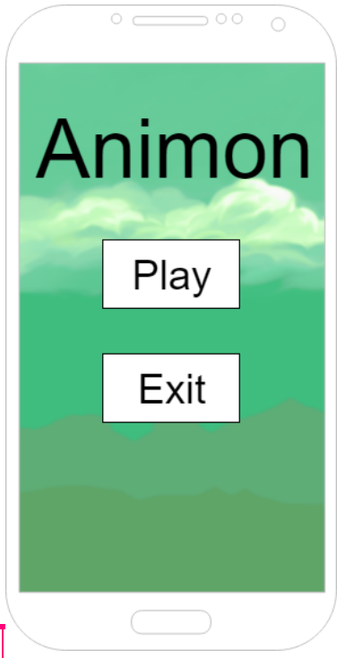
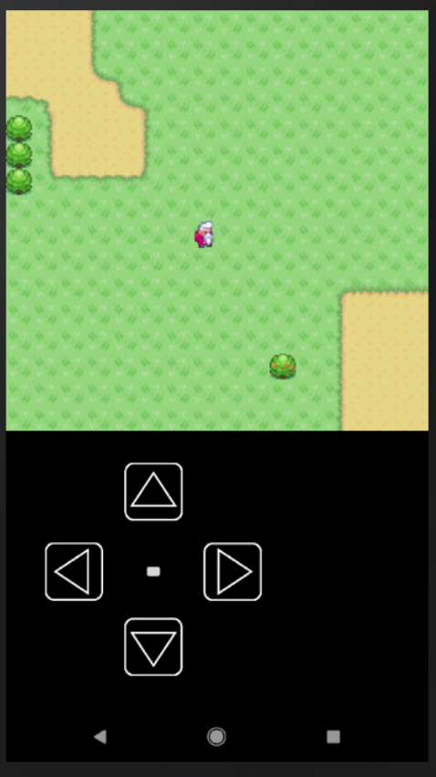
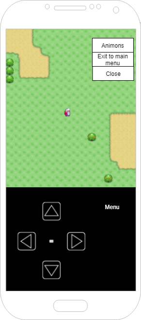
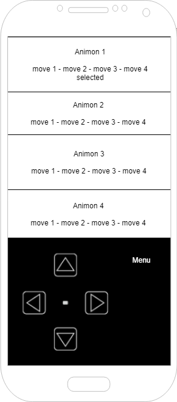
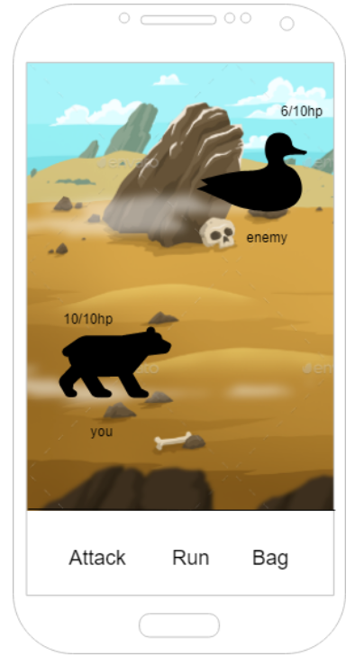

# Functioneel ontwerp

## Doel

In `Animon` kan de speler rondlopen over de map met behulp van de knoppen onderaan het scherm. Wanneer de speler door het gras loopt is er een kans om een Animon tegen te komen. Je hebt dan een optie om weg te rennen met een kleine kans van slagen, de optie om te vechten of om de Animon te vangen. De Animon die in het bezit zijn van de speler kan je healen bij het Animoncentre. De Animon kan levels omhoog gaan door gevechten te winnen, je krijgt dan meer HP en je doet meer damage. 

## Mockups

Animon is een RPG spel waarin de speler opzoek naar Animon. Animon zijn beesten die de speler kan vangen en trainen om zo de beste Animon te hebben.

### Hoofdmenu:
Dit menu wordt geopent zodra de speler de app opent. 

In dit scherm kan de speler een van de drie opgeslagen spellen selecteren. Op basis van deze saves wordt bepaald waar in het spel en welke animon de speler heeft.

### Spel scherm:
Hierin kan de speler opzoek gaan naar animon.

- De speler kan bewgen door de pijltjes knoppen onder in het scherm te gebruiken.
- Nadat de speler in gras of door water vaart kan hij een animon tegenkomen.
- Als de speler op de menuknop drukt krijgt hij een menu te zien. 
- Bomen blokkeren de weg en daar kan je niet door heen lopen.
- Bij een Animon center kan je je animon genezen.

### Menu scherm
In onderstaande menu kan men zijn of haar animons inzien en terug naar het hoofdmenu. Uiteraard kan het menu ook gesloten worden.

Hier kan de speler selecteren om naar het animon scherm te gaan. Of het spel op te slaan.

- save: slaat het spel op.
- Animon: gaat naar  het animon collectie scherm.

### Animon collectie scherm 
Hierin ziet de speler een overzicht van alle Animons die hij in zijn team heeft en verzameld. 

### Animon battle scherm
Dit scherm verschijnt nadat de speler in het gras of water een animon heeft gevonden.

- Attack: deze knop zorgt ervoor dat de speler uit vier aanvallen kan kiezen om de vijand mee aan te vallen.
- Run: Hiermee heb je de kans om weg te rennen van het gevecht en terug te keren naar het spel scherm.
- Bag: In je bag kan je kooien gooien om de animon te vangen en potions on je animon te genezen. 
- je ziet jou animon links en de vijandelijke animon rechts
- Boven hun naam staat een HP bar. 

